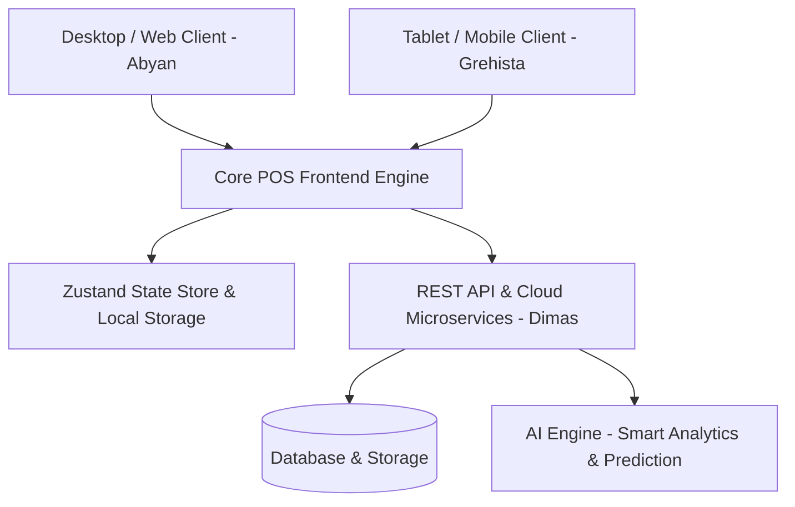

# ⚡ POS Kasir — Next-Gen Retail & Point of Sale System
### 🏆 Official Project Submission for IDWEBHOST Hackathon 2026

[](#)
[](#)
[](#)
[](#)
[](#)

---

## 🌟 The Grand Comeback Story

> **"Dari Inovasi Alat Diagnosis Menuju Revolusi Ekosistem Retail Digital."**

Proyek ini menandai **kebangkitan besar (The Grand Comeback)** setelah dedikasi pada project sebelumnya di GitHub (*AI Medical & Health Diagnostic Tool*). Mengambil pelajaran berharga dari presisi, kehandalan, dan arsitektur tingkat tinggi pada sistem diagnosis medis sebelumnya, tim kami kini bersatu di ajang bergengsi **IDWEBHOST Hackathon 2026** untuk memecahkan tantangan nyata di sektor retail dan Point of Sale (POS).

Aplikasi **POS Kasir Enterprise** ini diciptakan untuk menjadi solusi kasir lintas platform yang ultra-cepat, intuitif, berestetika modern, dan siap diintegrasikan dengan kecerdasan buatan (AI) serta infrastruktur cloud masa depan.

---

## 👥 The Dream Team (3 Core Builders)

Proyek ini dirancang, diarsiteki, dan dibangun secara kolaboratif oleh 3 spesialis berdedikasi tinggi:

| Foto / Profil | Anggota Tim | Peran & Tanggung Jawab Utama |
|:---:|:---|:---|
| 👑 | **Abyan (Project Lead)**<br>`@abyryn` | **Team Leader • Frontend Lead • Desktop Developer**<br>• Menentukan visi teknis, roadmap, dan arsitektur modular sistem.<br>• Membangun antarmuka utama POS, logic state management (Zustand), dan arsitektur Desktop/Web client.<br>• Merancang sistem kasir cerdas: shift cash flow, hold/recall cart, dan dynamic approval flow. |
| 🧠 | **Dimas Apriliano** | **Backend Engineer • AI Engineer • DevOps**<br>• Mengembangkan arsitektur backend, REST/GraphQL microservices, dan database persistensi.<br>• Merancang integrasi kecerdasan buatan (AI engine) untuk prediksi penjualan pintar & rekomendasi produk.<br>• Mengelola automated CI/CD pipeline, containerization, deployment, dan reliabilitas server cloud. |
| 📱 | **Grehista** | **Frontend Developer • Mobile App Specialist**<br>• Mengembangkan adaptasi POS untuk perangkat mobile dan tablet (Android & iOS).<br>• Mengoptimalkan touch gesture, responsivitas layout tablet/ponsel, dan mobile user experience.<br>• Melakukan quality assurance pada performa cross-platform di berbagai resolusi layar. |

---

## 🚀 Fitur Unggulan

### 🟢 1. Core POS & Shift Management (MVP)
- 🔐 **Secure PIN-Pad Login**: Akses cepat kasir & manajer dengan enkripsi role-based.
- 💵 **Shift Management Presisi**: Pencatatan kas awal (Open Shift), pelacakan transaksi real-time, hingga rekonsiliasi kas akhir (Closing Shift) dengan kalkulasi selisih otomatis (*variance calculation*).
- ⚡ **High-Speed Checkout**: Grid produk responsif dengan filter kategori instan dan pencarian barcode scanner (input manual/keyboard hook).
- 🛒 **Cart & Multi-Action System**: Kontrol kuantitas instan, kalkulasi pajak, diskon per item, dan total belanja real-time.
- ⏸️ **Hold & Recall Transaction**: Fitur simpan antrean belanja sementara untuk melayani pelanggan lain tanpa kehilangan data keranjang.

### 🔵 2. Retail & Store Operations
- 💳 **Multi-Payment Ready**: Pembayaran Tunai (dengan kalkulator kembalian otomatis), **QRIS Dinamis**, dan fitur **Split Payment** (kombinasi tunai + nontunai).
- 👤 **Customer & Member Loyalty**: Pencarian anggota pelanggan untuk akumulasi poin dan benefit reward.
- 🏷️ **Diskon Fleksibel**: Diskon nominal (`Rp`) maupun persentase (`%`) pada level item ataupun seluruh keranjang.
- 🛡️ **Manager Approval Workflow**: Sistem persetujuan berjenjang untuk pembatalan transaksi (*Void*), pengembalian produk (*Return*), serta arus kas manual (*Cash In / Cash Out*).
- 🧾 **Digital & Printable Receipts**: Cetak ulang struk transaksi kapan saja dengan rincian lengkap.

### 🟣 3. Enterprise, AI & Cloud Readiness (Roadmap)
- 🧠 **AI Smart Recommendation & Stock Prediction**: Prediksi kebutuhan stok barang berbasis pola riwayat transaksi.
- 📦 **Offline-First Synchronization**: Penyimpanan lokal SQLite dengan antrean sinkronisasi otomatis (*offline sync queue*) saat kembali online.
- 🖨️ **Hardware Integration**: Dukungan langsung untuk thermal printer (Bluetooth/USB/LAN), barcode hardware scanner, dan electronic cash drawer.
- 🌐 **Multi-Terminal Fleet Support**: Sinkronisasi data real-time antar meja kasir dalam satu outlet.

---

## 🛠️ Tech Stack & Architecture



### Frontend & Client Application
- **Framework**: [React Native 0.76](https://reactnative.dev/) via [Expo SDK 52](https://expo.dev/)
- **Language**: [TypeScript 5.3](https://www.typescriptlang.org/)
- **State Management**: [Zustand 5](https://github.com/pmndrs/zustand) (Modular & Reactive Store)
- **Navigation**: [React Navigation 6](https://reactnavigation.org/) (State-driven Screen Machine)
- **Icons**: [Lucide React Native](https://lucide.dev/)
- **Styling**: Sky Blue Enterprise Theme (Atomic tokens & Vanilla StyleSheet)

### Backend, AI & DevOps
- **Backend Architecture**: High-throughput REST API Services
- **AI Engine**: Data analytics model for retail intelligence & purchase patterns
- **DevOps & Cloud**: Docker containerization, automated CI/CD pipeline, and cloud hosting

---

## 🎨 Design System & Visual Identity

Mengusung tema **Sky Blue Enterprise System** yang dirancang untuk kenyamanan mata kasir dalam shift kerja panjang:

| Token | Nilai Hex | Penggunaan |
|---|:---:|---|
| **Primary** | `#0EA5E9` | Brand identity, tombol aksi utama, header aktif |
| **Background** | `#F8FAFC` | Latar belakang aplikasi yang bersih dan sejuk |
| **Surface** | `#FFFFFF` | Kartu produk, modal, panel keranjang |
| **Text Primary**| `#0F172A` | Teks utama dengan kontras tinggi |
| **Success** | `#22C55E` | Transaksi berhasil, uang pas, status lunas |
| **Warning** | `#F59E0B` | Hold bill, peringatan stok menipis |
| **Danger** | `#EF4444` | Void, retur barang, tombol batal |

---

## 📂 Struktur Direktori Proyek

```
frontend-pos-kasir/
├── App.tsx                        # Root application entry point
├── app.json                       # Expo configuration (Landscape & Multi-platform)
├── package.json                   # Project dependencies & scripts
├── src/
│   ├── theme/                     # Design tokens (Colors, Typography, Spacing)
│   ├── types/                     # TypeScript definitions & interfaces
│   ├── data/                      # Mock dataset (Products, Users, Stores)
│   ├── store/                     # Zustand state stores
│   │   ├── useAuthStore.ts        # Authentication, Active Shift, Permissions
│   │   ├── useCartStore.ts        # Cart operations, discounts, Hold/Recall
│   │   └── useTransactionStore.ts # Transactions, Void, Retur, Cash In/Out
│   ├── components/
│   │   ├── ui/                    # Reusable UI library (Button, Modal, Toast, Card, etc.)
│   │   └── pos/                   # POS modules (ProductCard, CartItem, DiscountModal)
│   ├── screens/                   # Application screens
│   │   ├── LoginScreen.tsx        # Secure PIN-Pad Screen
│   │   ├── OpenShiftScreen.tsx    # Shift opening & float cash input
│   │   ├── SalesScreen.tsx        # Main Dual-Panel POS terminal
│   │   ├── PaymentScreen.tsx      # Multi-method payment & Split bill
│   │   ├── ReceiptScreen.tsx      # Struk & Print preview
│   │   ├── TransactionHistoryScreen.tsx
│   │   ├── HoldRecallScreen.tsx   # Antrean transaksi tertunda
│   │   ├── VoidScreen.tsx         # Pembatalan transaksi
│   │   ├── ReturnScreen.tsx       # Pengembalian barang
│   │   ├── CashManagementScreen.tsx # Kas masuk / kas keluar
│   │   ├── ClosingShiftScreen.tsx # Tutup shift & perhitungan selisih
│   │   └── MemberSearchScreen.tsx # Pencarian member & loyalitas
│   └── navigation/
│       └── AppNavigator.tsx       # State-machine navigator
```

---

## 🚦 Permission & Security Matrix

| Modul Fitur | Kasir | Manajer / Supervisor | Catatan |
|---|:---:|:---:|---|
| **Login & PIN Access** | ✅ | ✅ | Akses individual |
| **Open & Close Shift** | ✅ | ✅ | Wajib input nominal riil kas |
| **Transaksi Penjualan** | ✅ | ✅ | Bebas transaksi |
| **Pemberian Diskon** | ✅ (Maks. 5%) | ✅ (Tanpa batas) | Kasir dibatasi 5% |
| **Void Transaksi** | ⚠️ *Approval* | ✅ | Memerlukan verifikasi PIN Manajer |
| **Retur Produk** | ⚠️ *Approval* | ✅ | Memerlukan verifikasi PIN Manajer |
| **Cash In / Cash Out** | ⚠️ *Approval* | ✅ | Memerlukan verifikasi PIN Manajer |
| **Riwayat Transaksi** | ✅ | ✅ | Akses catatan penjualan |
| **Member Loyalty** | ✅ | ✅ | Pencarian & penambahan poin |

---

## ⚡ Cara Menjalankan Aplikasi

### 📋 Prasyarat
- **Node.js** versi ≥ 18
- **npm** atau **yarn**
- **Expo CLI** (opsional): `npm install -g expo-cli`

### 💻 Instalasi & Eksekusi

1. **Clone repository & masuk ke direktori:**
   ```bash
   git clone https://github.com/abyryn/frontend-pos-kasir.git
   cd frontend-pos-kasir
   ```

2. **Instal seluruh dependensi:**
   ```bash
   npm install
   ```

3. **Jalankan development server:**
   ```bash
   # Menjalankan Expo development server
   npm start

   # Menjalankan langsung di browser (Rekomendasi untuk tampilan Desktop/Landscape POS)
   npm run web

   # Menjalankan di Android Emulator / Device
   npm run android

   # Menjalankan di iOS Simulator
   npm run ios
   ```

### 🔑 Kredensial Akun Demo

Gunakan akun demo berikut untuk menguji alur kerja kasir dan otorisasi manajer:

| Role | Employee ID | PIN | Hak Akses |
|:---|:---:|:---:|:---|
| **Kasir (Cashier)** | `KSR001` | `1234` | Transaksi harian, batas diskon 5%, butuh approval manajer untuk aksi sensitif |
| **Manajer (Manager)** | `MGR001` | `0000` | Full privilege, override diskon, persetujuan Void, Retur, dan Cash In/Out |

---

## 📜 Lisensi & Pengakuan

Dikembangkan dengan penuh dedikasi oleh **Tim IDWEBHOST Hackathon 2026** (Abyan, Dimas Apriliano, Grehista).  
Hak cipta dilindungi undang-undang © 2026.
